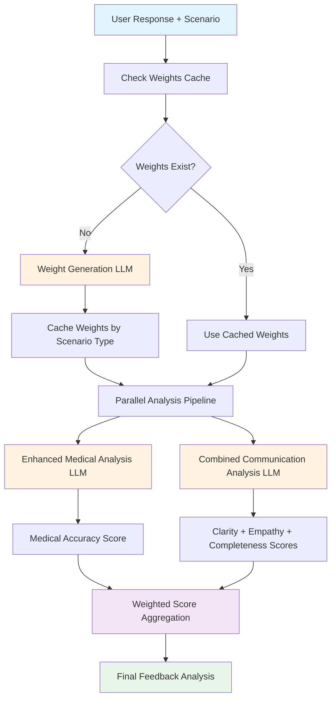

## Overview

This AI pipeline is designed for a healthcare communication training platform that evaluates healthcare professionals' patient interactions across four key dimensions: medical accuracy, communication clarity, empathy & tone, and completeness.

## Key Design Principles

### 1. Cost-Optimized Architecture
- **Reduced API calls from 4 to 2** (50% cost reduction)
- **Intelligent caching** of scenario weights to avoid redundant generation
- **Parallel processing** for maximum efficiency

### 2. Weighted Scoring System
- **Dynamic weight generation** based on scenario context
- **Scenario-appropriate emphasis**: Emergency situations prioritize medical accuracy, patient education emphasizes clarity
- **Consistent evaluation** across different healthcare contexts

### 3. Enhanced Medical Analysis
- **Two-step evaluation process**: First establish medical standards, then evaluate against them
- **Terminology-aware assessment** comparing user responses to correct medical practices
- **Safety protocol compliance** as a core evaluation criterion

## Pipeline Components

### Weight Generation & Caching
The system intelligently determines evaluation weights based on scenario characteristics:

- **Emergency scenarios**: Higher medical accuracy weight (0.5+)
- **Patient education**: Higher clarity weight (0.4+)
- **Anxious patients**: Higher empathy weight (0.4+)
- **Complex procedures**: Higher completeness weight (0.4+)

Weights are cached by scenario type (`medical_area_difficulty_patient_type`) to optimize performance.

### Enhanced Medical Analysis Chain
A specialized chain that:
1. **Establishes medical standards** for the specific scenario
2. **Evaluates the response** against those standards
3. **Provides terminology-specific feedback** and safety protocol assessment

### Combined Communication Analysis Chain
A cost-optimized chain that analyzes three dimensions in a single API call:
- **Clarity**: Health literacy, plain language, cultural sensitivity
- **Empathy**: Emotional intelligence, compassion, patient-centered approach
- **Completeness**: Coverage of key points, safety questions, next steps

### RAG-Enhanced Context System
The pipeline incorporates a **Retrieval-Augmented Generation (RAG)** approach by:
- **Retrieving recent feedback** from the user's previous attempts
- **Contextualizing analysis** with past improvement areas
- **Tracking progress** over time to provide personalized feedback

This context is specifically added to the communication analysis chains (empathy and completeness) to help the AI recognize whether users are applying previous feedback and improving over time.

### Weighted Aggregation
Final scoring applies scenario-appropriate weights rather than simple averaging, ensuring that the most critical aspects for each situation receive proper emphasis.

## Benefits

**Cost Efficiency**: 50% reduction in API costs while maintaining analysis quality

**Contextual Accuracy**: Weights adapt to scenario requirements automatically + RAG context for personalized feedback

**Comprehensive Evaluation**: Enhanced medical analysis with terminology standards + progress tracking

**Scalable Architecture**: Easy to extend with additional analysis categories or scenario types

**Consistent Quality**: Standardized evaluation approach across all healthcare communication scenarios